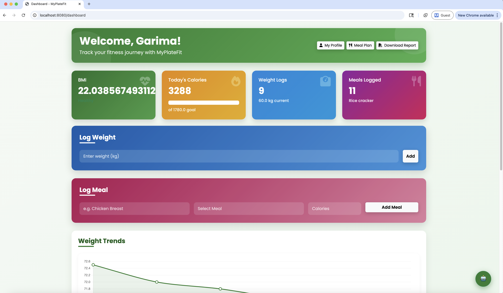

# 🥗 MyPlateFit - Personalized Nutrition Tracker

  
  
  
  
  

## ✨ Revolutionary Features

### 🔐 Security & Authentication
- **Password Recovery System** with Gmail SMTP integration
- **Role-based Access Control** using Spring Security
- **Session Management** for secure user experience

### 📊 Health Tracking & Visualization
- **BMI Calculator** with historical tracking
- **Weight Progress Charts** using Chart.js
- **Calorie Goal Monitoring** with daily targets
- **Nutritional Breakdown** by food groups

### 🍽️ Intelligent Meal Management
- **Automated Meal Planning** based on calorie goals
- **Recipe Explorer** with detailed instructions
- **USDA Food Database Integration** for instant nutrition data
- **Personal Food Library** for quick meal logging

### 🌟 Latest Innovations: Spoonacular Integration
- **Intelligent Meal Plan Generation** based on calorie needs
- **Recipe Details** with step-by-step instructions
- **Visual Recipe Cards** with high-quality food images
- **Nutritional Breakdown** per recipe and meal

## 🚀 Getting Started

### Prerequisites
Required Tools
Java 17+

PostgreSQL 14+

Maven 3.8+

Spoonacular API Key

text

### Installation Guide
Clone repository
git clone https://github.com/Garima001011/myplatefit-app.git
cd myplatefit-app

Configure environment
cp .env.example .env
nano .env # Add your API keys and credentials

Build and run
mvn spring-boot:run

text

### Configuration
application.properties
spoonacular.api.key=your_api_key_here
spring.mail.username=your_email@gmail.com
spring.mail.password=your_app_password

Database setup
spring.datasource.url=jdbc:postgresql://localhost:5432/nutrition_db
spring.datasource.username=db_user
spring.datasource.password=db_password

text

## 🧩 System Architecture
Client Browser → Thymeleaf Templates → Spring Controllers
↓
Spring Services → [USDA API, Spoonacular API, PostgreSQL Database]
↓
PostgreSQL → [User Data, Nutrition Data, Meal History]

text

## 📋 Feature Highlights

- **Authentication**:  
  Password recovery, Session management, Role-based access
- **Nutrition Tracking**:  
  BMI calculator, Weight history, Calorie goals, Food group breakdown
- **Meal Management**:  
  Spoonacular integration, Recipe explorer, Meal planning, Food library
- **API Integrations**:  
  USDA Food Database, Spoonacular meal plans, Recipe details
- **Visualization**:  
  Chart.js progress charts, Nutrition dashboards, Responsive UI

## 🛠 Development Roadmap

- [x] Phase 1: Core Authentication & User Management
- [x] Phase 2: Nutrition Tracking & Visualization
- [x] Phase 3: Spoonacular API Integration
- [ ] Phase 4: Mobile Application (React Native)
- [ ] Phase 5: AI-powered Meal Recommendations
- [ ] Phase 6: Social Sharing & Community Challenges

## 🧪 Testing & Quality
Run test suite
mvn test

Generate coverage report
mvn jacoco:report

text

## 💌 Contact & Support

Contact me via email or GitHub:

> "Let food be thy medicine and medicine be thy food." - Hippocrates  
> Built with ❤️ for a healthier world

## 📸 App Gallery

*Dashboard View*

*User Profile Page*

*Meal Log Entry Screen*

*Meal Recipes Suggestions*

*PDF Report Example*

*Chatbot Integration Using llama3*

**Transform Your Nutrition Journey with MyPlateFit**